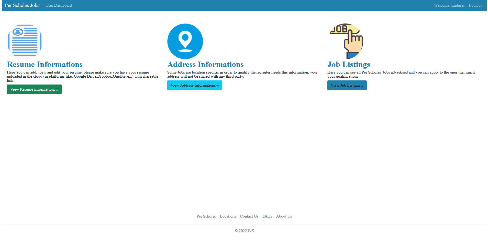

# Per Scholas' Job 

> This web app allows users to sign up, add their resume and address information, view job listings and apply. In addition to this, a user with admin role can create job listings, view job applications and delete users. 

## Installation 
To run this app, you will need:   
-  Java Development Kit 11 (JDK 11) or higher (click on the links below for installation instructions by Operating System): 
        -  [macOS](https://docs.aws.amazon.com/corretto/latest/corretto-18-ug/macos-install.html)
        - [Windows](https://docs.aws.amazon.com/corretto/latest/corretto-18-ug/windows-10-install.html) 
        - [Linux](https://docs.aws.amazon.com/corretto/latest/corretto-18-ug/generic-linux-install.html)
- MAVEN (the Java dependency manager) - [installation instructions](https://maven.apache.org/install.html).
- Node.js v16.14.0
- Angular v13.3.7
- MariaDB or any RDBMS like MySQL (if you are not using MariaDB, you have to change the driver in application properties in the back-end)


           

Before running the app you have to change few things in the application properties :
            

 - Assign your RDBMS' username to "spring.datasource.username"
 - Assign your RDBMS' password to "spring.datasource.password"
 - Change the port to your match your environment "spring.datasource.url" 
 - If you are not using MariaDB change the value of "spring.datasource.driver-class-name" to your respective driver example for MySQL  :  

> spring.datasource.driver-class-name=**com.mysql.jdbc.Driver**


After setting up your development environment, run the back-end server from the root directory of the project by entering the following commands in the your terminal:

```sh
cd backend_updated
mvn spring-boot:run
```
Then run the front-end server from the root directory of the project by entering the following commands in the your terminal:
```sh
cd frontend
npm start
```

## Tech Stack
- Java
- Maven as a dependency manager
- SCSS as CSS Preprocessor
- Angular framework using the following dependencies:
	- Angular 13.3.7
	- Popperjs : ^2.11.5
    -  Bootstrap: ^5.1.3
    - Font-awesome: ^4.7.0
    - JQuery: ^3.6.0
- Back-end was developed in Spring boot framework using the following dependencies:
	- Spring Boot 2.7.0 
    -  Spring Web
    -  Spring Data JPA
    -  MariaDB
    -  H2 In-memory Database
    -  Spring Web 
    -  Spring Validation
    -  Springdoc-openapi
    -  Lombok
    -  Spring Dev Tools
    -  Spring Test
	-  Spring Security
	-  JJWT 


